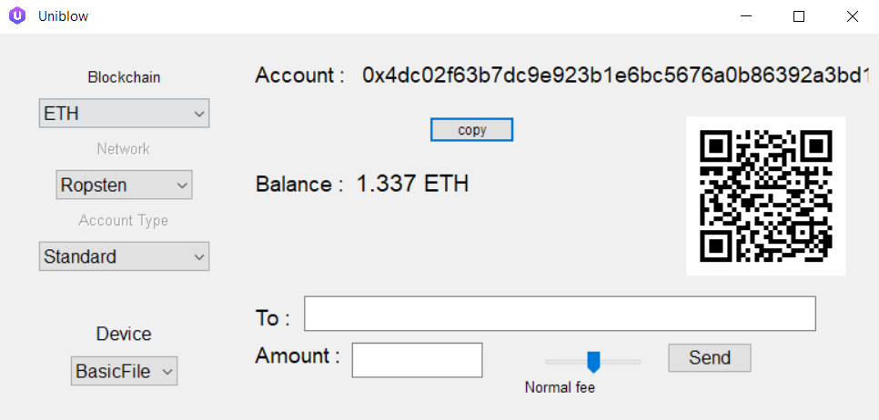

# Uniblow


A **uni**versal **blo**ckchain **w**allet for cryptos

* Handy, almost 1-click
* Fast and lightweight
* Don't wait for confirmation, instant transactions
* Multiple cryptos blockchains
* Multiple networks (testnets,...)
* Multi platforms : PC, Mac and Linux
* Open source GPLv3

The Uniblow software can also be used integrated in your services, as it
provides a unified, multi-platforms and blockchain agnostic interface to manage
many different wallets. By using the wallet class, this is as simple as :
`ETH_wallet = wallet("ETH", "mainnet", device)`, and you get the interface
methods mentioned in the developer section below.



Don't expect to make complicated DeFi transactions, nor advanced settings for
the fees. This software provides an easy and basic wallet, focused on
universality and ease in use, as it works on multiple blockchains and platforms.

Compatible with the following blockchains :

* BTC
    * mainnet and testnet networks
    * Standard wallet (P2PKH)
    * Segwit P2SH compatibility
    * Full Segwit bech32 (P2WPKH)
* ETH
    * mainnet, Rinkeby, Ropsten, Kovan and Goerli networks
    * ERC20 tokens
* LTC
    * mainnet and testnet networks
    * Standard wallet (P2PKH)
    * Segwit P2SH compatibility
* DOGE
    * mainnet and testnet networks
* BSC
    * mainnet and testnet networks
    * BEP20 tokens
* EOS
    * K1 wallet
    * EOSio and Jungle3 networks
* XTZ
    * tz2 wallet
    * Main Tezos and Edo testnet networks


## Devices

### Seed Watcher

Useful for paperwallets or one-time analysis of a mnemonic seed. This specific device can be also useful to provide an ephemeral temporary wallet.

This devices doesn't store permanently the private keys. It provides a window GUI to read a mnemonic seed, analyzes it, and displays the major cryptos held by this given mnemonic, with their respective balance. It can also securely generate new BIP39 mnemonic seeds. Then one can load a given asset wallet in the app to make some transactions.

Note that Seed Watcher only looks at the first address. If you used a full HD wallet for BTC, LTC or DOGE (such as Electrum), the balance could not be recomputed properly.

### BasicFile device

The BasicFile device encrypts your private key [with a random salt using libsodium
XSalsa20/Poly1305](https://libsodium.gitbook.io/doc/secret-key_cryptography/secretbox#algorithm-details),
with an encryption key derived from the user chosen password using [Argon2id
(moderate settings)](https://raw.githubusercontent.com/P-H-C/phc-winner-argon2/master/argon2-specs.pdf).
One can choose to use a default password. To do so, just left blank the password
prompt input when asked the first time at device setting. Without your personal
password, the security of the key is what your hard-drive computer offers for
your files.  
If you setup a password but forget it, there would be no way to recover your
coins.

Your key encrypted is stored in JSON and hex in the *BasicFileWallet.key* in the
same folder as Uniblow. Hence the name "BasicFile" for this device. The key of this wallet is in a file named *BasicFileWallet.key*, stored in the same uniblow current directory. To backup it, copy the file elsewhere. To remove this wallet and start a fresh one, delete this file. You can also rename it and that would start a new different file wallet, and keep the first wallet aside. In this case, rename back to BasicFileWallet and you read back the first wallet.

### OpenPGP device

Works with an OpenPGP v3 device that accepts User Interaction confirmation
(button) and ECP 256K1 key pairs.

This device type is very secure, because the signature is performed in the
OpenPGP physical device, outside of the computer. Most of these devices are
built with a secure element chip. The private key never escapes the hardware
device boundary. Note that the drawback is that there is no easy backup of the
keys, so one have to take care of not forgetting the PIN or losing the device.
Some blockchain-based hardware wallets with the OpenPGP mechanism offer some
link with the seed, as the Ledger Nano S/X , [see details there](https://github.com/LedgerHQ/openpgp-card-app/blob/master/doc/user/blue-app-openpgp-card.rst).

For the best experience, the OpenPGP device should be in its default reset state
before using it with uniblow. Uniblow asks the user to choose the admin PIN
(PIN3), and the user PIN (PIN1), then it configures the device with these PINs.  
The device can also be already configured, with one EC256k1 key generated in the
SIG key slot. Uniblow will eventually ask for the user PIN1 and use this key.

Without backup, if you forget the PIN, or lost the OpenPGP device, there would
be no way to recover your coins.

The Yubico 5 is a recommended OpenPGP device.

### HDdevice

This wallet is compatible with BIP39/32/44 wallets. You can save 24 words when
initializing a new one, and get back you fund later.

You can also import an existing wallet from a compatible wallet, and it will use
the funds. Note that at this stage, there is a limitation on BTC, LTC and DOGE : it
only uses one static address for all transactions on a given blockchain. And it won't
retrieve your money if you use an other wallet with many transactions.

You can also export the saved words mnemonic in an other compatible wallet, and it
should access and use all you funds.

The HD device stores only the seed encrypted [with a random salt using libsodium
XSalsa20/Poly1305](https://libsodium.gitbook.io/doc/secret-key_cryptography/secretbox#algorithm-details),
using an encryption key derived from the user chosen password using [Argon2id
(moderate settings)](https://raw.githubusercontent.com/P-H-C/phc-winner-argon2/master/argon2-specs.pdf).
One can choose to use a default password. To do so, just left blank the password
prompt input when asked the first time at device setting. Without your personal
password, the security of the key is what your hard-drive computer offers for
your files.  
If you setup a password but forget it, there would be no way to recover your
coins from the backup file. But you can still initialize a new HD device wallet
with the same words mnemonic.

The seed of this wallet is in a file named *HDseed.key*, stored in the same uniblow current directory. To backup it, copy the file elsewhere. To remove this wallet and start a fresh one, delete this file. You can also rename it and that would start a new different HD wallet, and keep the first wallet aside. In this case, rename back to HDseed and you read back the first wallet.


## Run Uniblow - Use the GUI

On **Debian / Tails** :

* Download the Uniblow *deb* binary [from the Github releases](https://github.com/bitlogik/uniblow/releases/latest)
* Follow the [instructions of the dedicated instructions page](docs/LinuxBin.md).

To increase the security, the Debian/Tails binaries releases are [signed with our PGP key](https://bitlogik.fr/pgp/bitlogik.asc),
bringing even greater confidence in the integrity of the application. The checking process is described in [this
 instructions document](docs/LinuxBin.md).


On **Windows** : 

* Download the Uniblow binary [in the Github releases](https://github.com/bitlogik/uniblow/releases/latest)

To increase the security, the Windows exe releases are signed with our [Extended
Validation certificate](https://en.wikipedia.org/wiki/Code_signing#Extended_validation_(EV)_code_signing),
bringing even greater confidence in the integrity of the application.


## The SecuBoost seed derivation

Uniblow is offering an alternative to [the BIP39 mnemonic derivation method](https://en.bitcoin.it/wiki/BIP_0039). The SecuBoost algorithm is specific to Uniblow, so it won't work in a different wallet. This derivation option replaces the key derivation function of the BIP39 standard for a much stronger one. The key derivation (BIP39 or SecuBoost) is used to turn your mnemonic words list and password into the BIP32 seed (the H.D. wallet first data key).

The benefit is that you can use a "weaker" password for your wallet, so it is easy to remember. For exemple 2 random words in the dictionnary would take years to recover. Similarly, only 5 random letters would take also years to be recovered. By strengthening the derivation, one can use a password which is much easier to remember. An other benefit is even without any password setup, it protects your mnemonic better because the derivation is more difficult, and more specific.

Technically, the [HMAC](https://en.wikipedia.org/wiki/HMAC)(SHA512 x 2048) is replaced with [Scrypt](http://passwords12.project.ifi.uio.no/Colin_Percival_scrypt/Colin_Percival_scrypt_Passwords12.pdf)(8 x Sensitive, spaces removed). A high-end [GPU hash-box](https://www.shellntel.com/blog/2017/2/8/how-to-build-a-8-gpu-password-cracker) can perform 1 million BIP39 derivations per second. With SecuBoost, it is approximately only 10 per second. The SecuBoost derivation is 100'000 times slower and additionnaly it takes 1GB RAM per try, so it is also very robust against large scale parallel hardware attack. The SecuBoost algorithm is designed to use a larger amount of memory and time, making a hardware implementation much more expensive, and therefore limiting the amount of parallelism one can use for brute-force recovery. Even a dictionnary attack would be slowed down by this time factor.

Note that this algorithm, per design, uses extensive resources : requires 1 GB RAM, and takes approximately 20 seconds on a desktop computer.


## Development

### Use it from source

* For the GUI, [install wxPython 4](https://wxpython.org/pages/downloads/) with your system binaries wheels.
    * **Windows** : Install [Python3](https://www.python.org/ftp/python/3.8.10/python-3.8.10-amd64.exe), then run `pip3 install wxPython==4.1.1`
    * **MacOS** : Use `pip3 install wxPython==4.1.1`
    * **Linux** : Read the [LinuxDev document](docs/LinuxDev.md) for more details
* Install the uniblow package and its dependencies
    * `python3 setup.py install --user`
* For ETH, put your Infura key in ETHwallet, or use the EtherscanAPI. The binaries have the InfuraKey embedded.
* Run with `python3 uniblow.py`


### ToDo list

Future features :

* Full HD wallet device, avoiding address reuse, and discover in all account chains (external and internal change).


### Add more cryptos

For developers, one can easily add any crypto in this wallet, following this Python3 programming interface class :

```Python
class newCOINwallet:

    coin = "SYM"

    def __init__(self, coin, *options):
     ... create the wallet, for now options is network,wtype indexes (indexing the list returned by get_networks and get_account_types)

    def get_networks(self):
     ... return list of different possible networks names

    def get_account_types(self):
     ... return list of different possible account types

    def get_account(self):
     ... return the account name (address or similar)

    def get_balance(self):
     ... return a string with the balance and the symbol ticker

    def check_address(self, addr_str):
     ... return True if the address/account name is valid
    
    def history(self):
     ... return an URL string for the account details

    def transfer(self, amount, to_account, fee):
     ... transfer to pay x coin unit to an external account and return txid
     ... fee is 0, 1 or 2 : "economic", "normal", "fast"
    
    def transfer_all(self, to_account, fee_priority):
     ... transfer all the wallet to an address (minus fee)
     ... fee is 0, 1 or 2 : "economic", "normal", "fast"
```